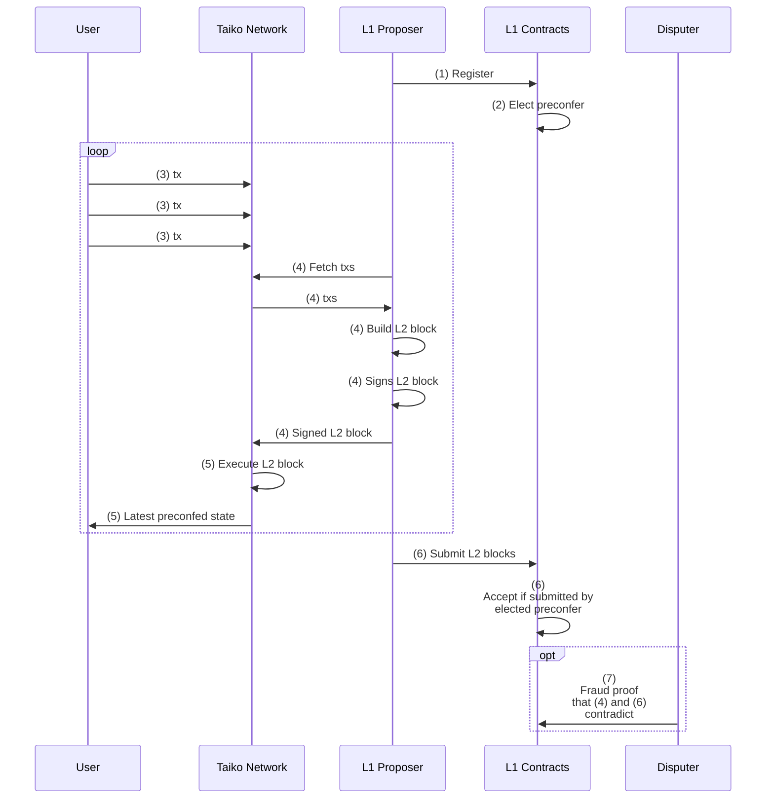
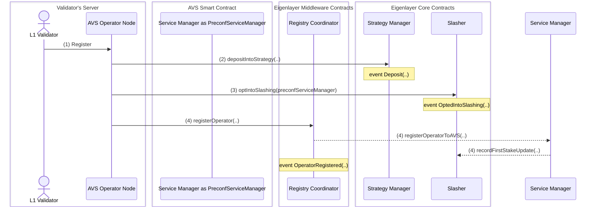
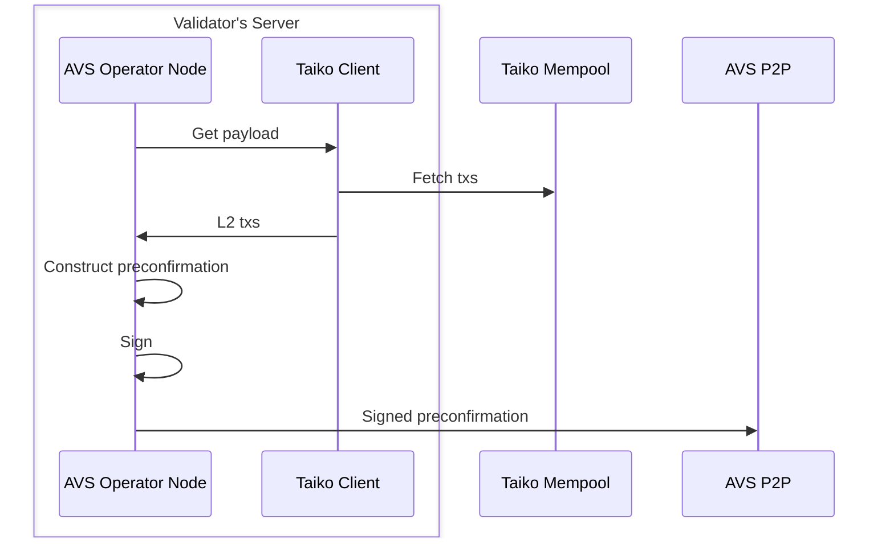
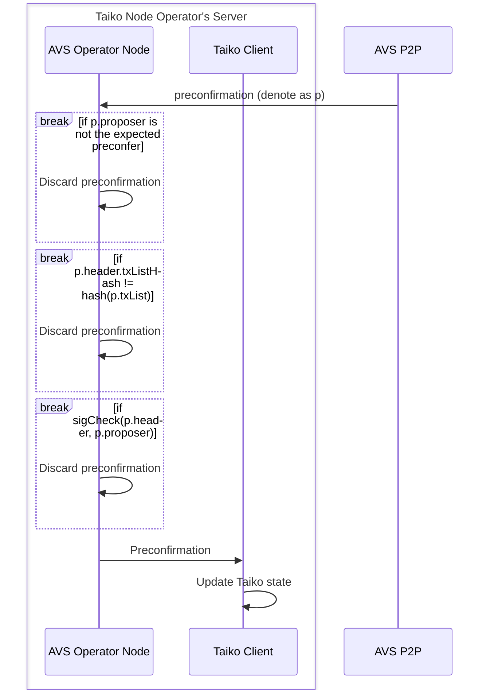
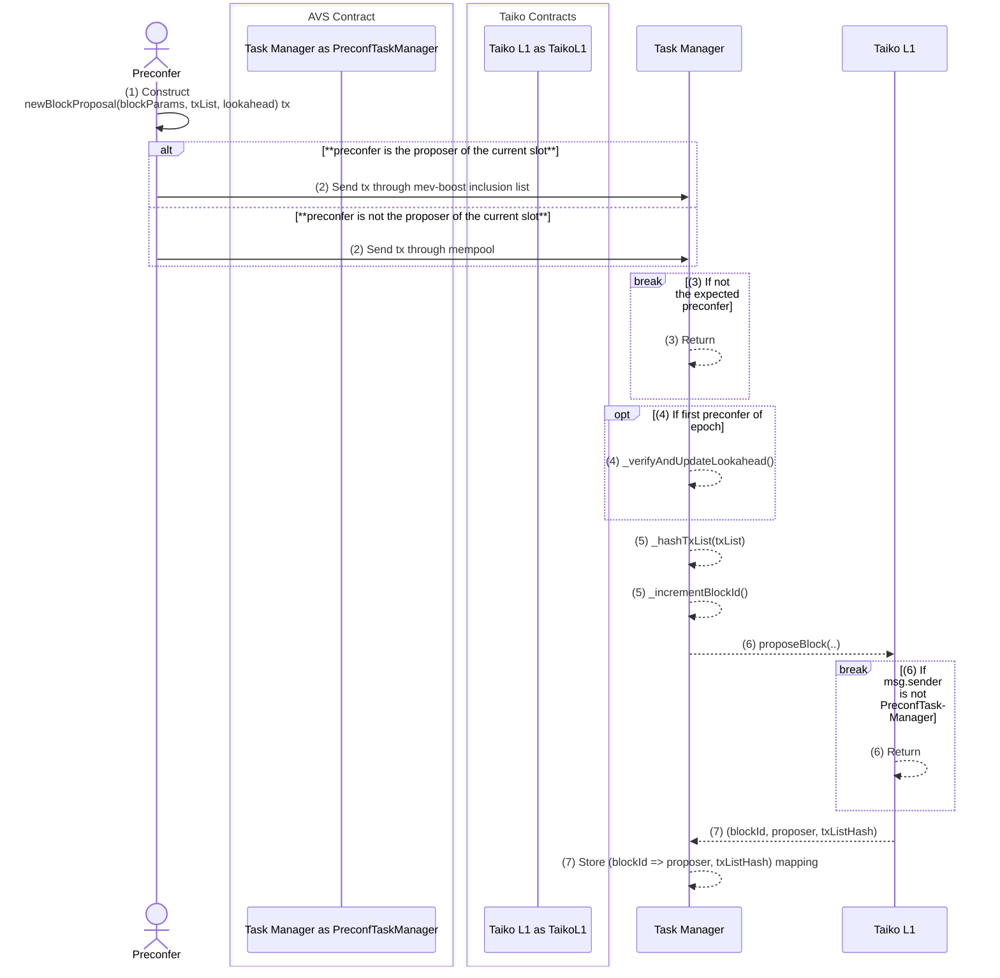
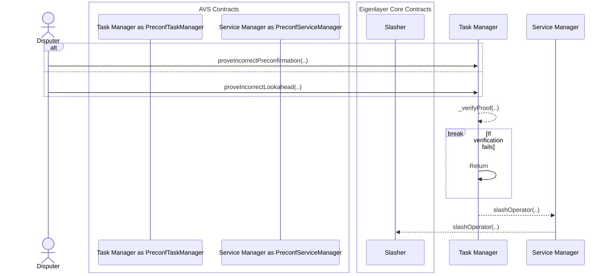
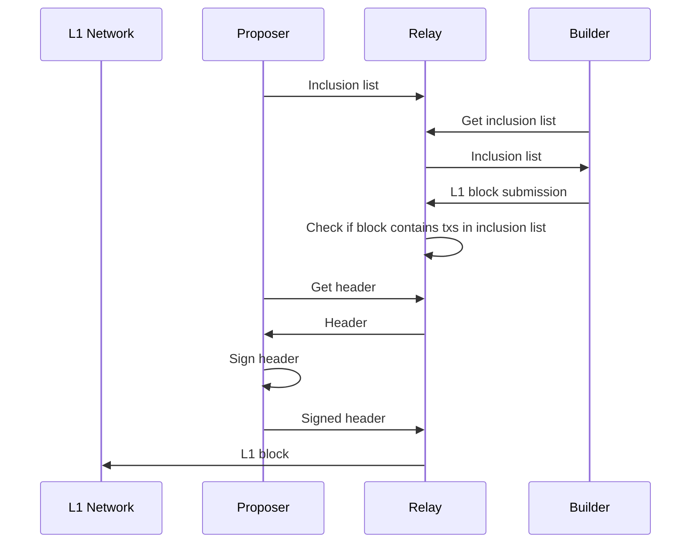

# Design Doc: Taiko Preconfirmation PoC

# Introduction

Since Taiko is a [based rollup](https://ethresear.ch/t/based-rollups-superpowers-from-l1-sequencing/15016/), Taiko users must wait for the L1 block proposal (~12 seconds) to know whether and how their transaction is included in a Taiko L2 block. This results in a poorer user experience compared to non-L1-based rollups, which can provide *preconfirmations* (commitments to transaction results) in much shorter time frames by utilizing their centralized sequencers.

In this post, we outline a PoC design to bring [based preconfirmations](https://ethresear.ch/t/based-preconfirmations/17353) to Taiko. This will enable Taiko users to receive preconfirmations of their L2 transactions without waiting for them to be included in the L1 blocks.

# PoC Overview

At a high level, the PoC will work as follows:

- Each L1 slot is divided into four 3-second "sub-slots"
- At the end of each sub-slot, the preconfirmer, who is elected from the opted-in L1 proposers, will build, sign, and publish Taiko L2 blocks to the network (i.e., they will *preconfirm* an L2 block).
- Taiko users will listen to these preconfirmed L2 blocks to know the result of their L2 transaction without waiting for L1 inclusion.

In the remainder of this section, we will outline the steps involved in providing preconfirmations and then explain the general flow of the PoC using a sequence diagram.

## The Seven Steps for Preconfirmations

Based preconfirmations consist of the following seven steps:

- **Step 1: Registration**: L1 proposers opt-in to provide preconfirmations (i.e. to become the *preconfer*).
- **Step 2: Election**: A single opted-in L1 proposer is chosen to be the preconfer for a given slot.
- **Step 3: Request submission**: L2 users submit transactions for which they wish to receive preconfirmations.
- **Step 4: Preconfirmation publication**: The elected preconfer provides the preconfirmations.
- **Step 5: State sync**: L2 node operators update their local L2 state based on the preconfirmed transactions.
- **Step 6: L1 inclusion**: The L2 transactions are submitted and included in L1.
- **Step 7: Slashing**: Slash the preconfer if the preconfirmations provided in step 4 contradict what was included in step 6.

The following sequence diagram is a high-level illustration of how these seven steps will be executed in our PoC design:



- (1) L1 Proposer registers to become a preconfer.
- (2) The L1 contracts elect the preconfer from the registered L1 proposers.
- (3) Users of L2 submit their transactions to the public Taiko mempool.
- (4) The elected preconfer collects transactions from the L2 mempool, builds an L2 block, and propagates the block to the Taiko network. The propagation of this L2 block functions as a preconfirmation on the L2 block.
- (5) Taiko full nodes in the network will:
    - Check that the signer of the L2 block is the expected preconfer.
    - Execute the L2 block.
    - Provide the latest preconfed state to users.
- (3)~(5) is repeated 4 times until the end of the slot.
- (6) L1 proposer submits the preconfirmed L2 blocks to the L1 Taiko inbox contract.
    - Since proposers do not build blocks in the current PBS pipeline, they will use inclusion lists to force the builder to include the L2 blocks in the L1 block. More on this is in [Appendix: MEV-Boost Modification for Forced Inclusion List](https://www.notion.so/Appendix-MEV-Boost-Modification-for-Forced-Inclusion-List-685e9b4e89eb43b48c5b172c220be7a7?pvs=21) .
- (7) A disputer, who can be anyone, submits fraud proofs if the preconfed block published in (4) contradicts the L2 blocks submitted in (6).

# Components

The PoC will be implemented as an [EigenLayer AVS](https://www.eigenlayer.xyz/ecosystem?category=Rollup%2CAVS%2COperator). Two main components are involved: the *AVS smart contracts* and the *AVS operator node*.

In this section, we will explore what each of these components does at a high level. Further details on how these components interact will be covered in the following [Implementation](https://www.notion.so/Implementation-1debf554210242cd9880d7c7e5e16282?pvs=21) section.

### **AVS smart contracts**

L1 contracts for managing preconfirmations. There will be two main contracts:

- **PreconfServiceManager**
    - Manages preconfer registration by interacting with the [EigenLayer middlewares](https://github.com/Layr-Labs/eigenlayer-middleware?tab=readme-ov-file#documentation). Also accepts and processes slashing requests from the `PreconfTaskManager`.
- **PreconfTaskManager**
    - Handles and manages preconfirmation tasks, which include election of preconfer, handling L2 block proposals, and resolving disputes against preconfirmations.

### **AVS operator node**

Nodes that will handle preconfirmation-related duties. They will run alongside both:

- Opt-in L1 proposers that want to preconfirm Taiko L2 blocks.
- Taiko full nodes that are interested in syncing with the preconfed L2 blocks.

They will be responsible for:

- Interacting with the AVS smart contract to register/deregister as a preconfer.
- Connect to the Taiko mempool and build Taiko L2 blocks to preconfirm.
- Propagate the Taiko L2 blocks to the AVS P2P.
- Receive preconfirmed Taiko L2 blocks from AVS P2P and progress the Taiko state.

# Implementation

In this section, we will outline how the PoC will implement each step in the [The Seven Steps for Preconfirmations](https://www.notion.so/The-Seven-Steps-for-Preconfirmations-fb88cdf993c24e60b931f20568f9cde5?pvs=21).

## Step 1: Registration

The registration flow is illustrated in the following sequence diagram:



- (1) The L1 validator invokes the registration process via their local AVS operator node.
- (2) The operator node deposits the required stake to the [Strategy Manager contract](https://github.com/Layr-Labs/eigenlayer-contracts/blob/a888a1cd1479438dda4b138245a69177b125a973/docs/core/StrategyManager.md) of EigenLayer core.
- (3) The operator opts into slashing by calling the [Slasher contract](https://github.com/Layr-Labs/eigenlayer-contracts/blob/a888a1cd1479438dda4b138245a69177b125a973/src/contracts/core/Slasher.sol#L14).
    - Note: Since the slasher contract has [not yet been implemented](https://github.com/Layr-Labs/eigenlayer-contracts/blob/a888a1cd1479438dda4b138245a69177b125a973/src/contracts/core/Slasher.sol#L14) in EigenLayer, we will implement our own mock contract for the PoC.
- (4) The operator registers as a preconfer operator by calling [Registry Coordinator](https://github.com/Layr-Labs/eigenlayer-middleware/blob/mainnet/docs/RegistryCoordinator.md) Eigenlayer middleware.

## Step 2: Election

The AVS contract (`PreconfTaskManager`) elects a single preconfer from the set of registered validators for a given slot. There are two cases to consider:

- **Preconfer slot:** The proposer of the slot is registered as a preconfer. For this case, the preconfer for that slot will be the proposer.
- **Non-preconfer slot:** The proposer of the slot is not registered as a preconfer. For this case, we follow the idea in the [original based preconf post](https://ethresear.ch/t/based-preconfirmations/17353) and let the next preconfer in the lookahead provide preconfirmations.

There are two issues we must address in order to implement this election mechanism:

- **Lookahead Visibility**:
    - EVM does not have visibility of the proposer's lookahead, including the current proposer. This is because the [beacon root available in the EVM](https://eips.ethereum.org/EIPS/eip-4788#background) is that of the previous slots. This makes it impossible for the `PreconfTaskManager` contract to verify if the submitted L2 block is provided by the proposer.
- **Empty Lookahead**:
    - We need a fallback mechanism for when there is no opted-in proposer in the lookahead.

In the following we will deep-dive into how these two issues will be addressed in our PoC.

### **Lookahead Visibility**

In order to give the L1 contract visibility on the lookahead, we require the first preconfer of the epoch to post the lookahead of the next epoch together with their L2 block submission, as illustrated below:

```solidity
|--p1(n)--p2(p)--p3(n)--p4(p)--p5(p)--|--p6(n)--p7(p)--p8(n)--p9(n)--p10(p)-|
           |
           submit lookahead 
           of next epoch (p6, p7, p8, p9, p10)
           when submitting their L2 block

p(p): Preconfer
p(n): Non-preconfer
```

The preconfer that submitted the lookahead is slashed if the lookahead is wrong, which can be proven after the invalid preconfer’s slot passes. Details on the slashing conditions are explained in the [Step 7: Slashing](https://www.notion.so/Step-7-Slashing-bb151c894bb54c47b8d220f3f7055720?pvs=21) section.

### **Empty Lookahead**

Another issue is, what if the next epoch has no preconfers, as the following?

```solidity
|--p1(p)--p2(n)--p3(p)--p4(n)--p5(n)--|--p6(n)--p7(n)--p8(n)--p9(n)--p10(n)-|
```

In this case, we fall back to [Limechain-style random selection](https://ethresear.ch/t/vanilla-based-sequencing/19379#fallback-selection-12), where the preconfer is selected at random from the registered validators. We will select a single preconfer for the whole epoch. This is a setup proposed by Justin Drake at https://www.youtube.com/watch?v=PM2EyV72Pls.

```solidity
|--p1(p)--p2(n)--p3(p)--p4(n)--p5(n)--|--p6(n)--p7(n)--p8(n)--p9(n)--p10(n)-|
                                         |______________________________|
                                                         |
                                                    p42(p) (chosen at random)
                                                    will preconf
                                                    for this duration
```

Since this preconfer is not the proposer of any of the slots in their assigned epoch, they cannot guarantee the inclusion of their preconfirmed L2 blocks. In other words, there is a risk that there will be yet-to-be-included preconfs blocks after their assigned epoch passes. To mitigate this risk, the preconfer will have to either:

- (A) Stop providing preconfs toward the end of the epoch to have enough slots to include their txs with high probability.
- (B) Coordinate with the upcoming preconfer in the next epoch to build upon the yet-to-be-included preconfirmed blocks, and have the coordinator include these blocks in their slot if necessary.

We will implement (A) for the PoC. Additionally, we are exploring ways to enhance and introduce (B) by adding crypto-economic guarantees that enforce the commitment to coordination as a future extension.

## **Step 3: Request Submission**

Preconfirmation requests from users will be submitted as usual Taiko transactions via the existing Taiko public mempool. Transactions with higher L2 priority fees will have a higher chance of being preconfirmed, as the L2 priority fee will go to the preconfer.

## Step 4: Preconfirmation Publication

For slots in which a preconfirmer is elected, the preconfirmer will publish preconfirmations four times within every slot. The preconfirmations format will be the following:

```solidity
struct Preconfirmation {
    PreconfirmationHeader header;
    bytes signature;  // Signature by proposer on the header
    address proposer; // The preconfirmer's address
    bytes txList;     // List of L2 txs we will preconfirm
}

struct PreconfirmationHeader {
  	uint256 blockId; // ID that increments for each L2 block proposal.
    uint256 chainId;
	  bytes32 txListHash;
    // Note: We may add more fields if required for deterministic L2 execution.
}
```

This preconfirmation struct will be constructed and published by the preconfer as the following:



## Step 5: State Sync

Any Taiko full node operator who is interested in knowing the latest preconfirmed state will run an AVS operator node locally and listen to the AVS P2P network. When a new preconfirmation arrives, the node will verify that the signer is indeed the elected preconfirmer and then execute the L2 transactions in the preconfirmation to obtain the latest preconfirmed state.

This process is illustrated below:



Note that, as illustrated above, the AVS operator node will discard the preconfirmation if:

- The preconfirmation was not from the expected preconfer, or
- the `txListHash` and `txList` do not align, or
- the signature check by the preconfer fails

## Step 6: L1 Inclusion

The preconfers will need to eventually include their preconfed L2 transactions to the L1 to avoid being slashed. There are two scenarios to consider depending on when this inclusion happens:

- **The preconfer is the proposer of the current slot**:
    - In this case, the preconfirmer will submit the list of preconfirmed transactions to the L1 builders via forced inclusion lists in MEV-Boost. Since the current version of MEV-Boost does not support forced inclusion lists, we will implement our own fork of MEV-Boost to add this functionality. More details on this fork can be found in [Appendix: MEV-Boost Modification for Forced Inclusion List](https://www.notion.so/Appendix-MEV-Boost-Modification-for-Forced-Inclusion-List-685e9b4e89eb43b48c5b172c220be7a7?pvs=21)
- **The preconfer is not the proposer of the current slot**:
    - In this case, the preconfer will submit the list of preconfirmed transactions via the L1 mempool.

The preconfirmed L2 transaction submission will be done via the `newBlockProposal` function in the `PreconfTaskManager` contract. This function works as follows:



- (1) Construct a transaction that invokes `newBlockProposals(txList, lookahead, blockParams)` is included in the L1 block.
    - `txList`: The list of preconfirmed L2 transactions.
    - `lookahead`: The lookahead of the next epoch. Only required if the preconfer is the first preconfer of the epoch.
    - `blockParams`: Additional metadata that is required for the block proposal.
- (2) Send the above transaction to the L1 `PreconfTaskManager` either via MEV-Boost forced inclusion list or public mempool, depending on whether the preconfer is the current slot’s proposer.
- (3) Check if the sender is the elected preconfer and abort if they are not. This can be checked by referencing the previously submitted lookahead.
- (4) If the sender is the first preconfer of the epoch, verify the `lookahead` (e.g. it is not empty) and update the contract’s view of the lookahead.
- (5) Process the block and submit the L2 txs to the [TaikoL1 contract](https://github.com/taikoxyz/taiko-mono/blob/ef3d7d5c32e0687e273d149bc7ba1da5642fb9ba/packages/protocol/contracts/L1/TaikoL1.sol#L74).
- (6) TaikoL1 contract checks if the sender is `PreconfTaskManager`, and aborts if not.
- (7) If the L2 block is accepted by the TaikoL1 contract, store the `(blockId => proposer, txListHash)` mapping within the `PreconfTaskManager` contract. This mapping will be used in the  [Incorrect Preconfirmation Slashing](https://www.notion.so/Incorrect-Preconfirmation-Slashing-5fe36e637eb54ced88d7a43b8b6c83c4?pvs=21) below.

## Step 7: Slashing

The preconfer will be slashed if they equivocate during their preconfirmation duties. There are two kinds of slashing in the PoC:

- **Incorrect Preconfirmation Slashing**: Slashes when the preconfirmed L2 block was not submitted to L1 as promised.
    - Implemented as `proveIncorrectPreconfirmation(..)` function in the `PreconfTaskManager`.
- **Incorrect Lookahead Slashing:** Slashes when the preconfer [submitted](https://www.notion.so/EXT-Design-Doc-Taiko-Preconfirmation-PoC-74db78ff89df4aa8983ed1e640a05359?pvs=21) an incorrect lookahead.
    - Implemented as `proveIncorrectLookahead(..)` function in the `PreconfTaskManager`.

For both `proveIncorrectPreconfirmation` and `proveIncorrectLookahead`, the slashing will be conducted by invoicing the `Slasher` contract of EigenLayer core via the `PreconfServiceManager` as the following:



Next, we will dive deep into how these slashing conditions can be implemented within the `PreconfTaskManager`.

### Incorrect Preconfirmation Slashing

This slashing should happen when the preconfirmed L2 block contradicts with the L2 block submitted to the L1. More concretely, slashing would happen the following two contradict each other:

- The `Preconfirmation` object published by the preconfer at [Step 4: Preconfirmation Publication](https://www.notion.so/Step-4-Preconfirmation-Publication-d6620e19f3334226a96311ed315c92d0?pvs=21)
- The `(blockId => proposer, txListHash)` mapping which is [recorded](https://www.notion.so/EXT-Design-Doc-Taiko-Preconfirmation-PoC-74db78ff89df4aa8983ed1e640a05359?pvs=21) when the L2 block is submitted to L1.

Below is a pseudo-code for this slashing condition:

```solidity
contract PreconfTaskManager {
		struct ProposedBlock {
			address proposer;
			bytes32 txListHash;
		}
		
		struct PreconfirmationHeader {
			uint256 blockId;
			uint256 chainId;
			bytes32 txListHash;
		}

    // Mapping from blockID to txListHash of recently submitted L2 blocks.
    // This will be represented more efficiently (e.g. using ring buffer) 
    // in actual implementation.
    mapping(uint256 => ProposedBlock) proposedBlocks;
    
    
    // Slash if the preconfirmed txList does not match the submitted txList
    function proveIncorrectPreconfirmation(PreconfirmationHeader memory header, bytes memory signature) {
      ProposedBlock _pb = proposedBlocks[header.blockId];
      
      require(header.chainId == block.chainId);
      require(_pb.txListHash != header.txListHash);
	    require(_pb.proposer == recover(signature, hash(header)));
       
      _preconfServiceManager.slashOperator(_pb.proposer);
    }
}

```

### Invalid Lookahead Slashing

The preconfer that submitted the lookahead is slashed if the lookahead is wrong, which can be proven after the invalid preconfer’s slot passes. For example, in the above example, the actual lookahead is `p6, p7, p8, p9, p10` but `p2` (first preconfer of previous epoch) submits the lookahead as `p6, p7, p8', p9, p10`. After slot `8` passes, this difference can be proved via a fraud-proof by submitting both:

- (A) Proof that the proposer for slot `8` was `p8` and not `p8'`.
    - This can be done via Merkle proof on the beacon head of slot `8`, proving that `proposer_index` is that of `p8`.
- (B) Proof that the proposer change was not due to `p8'` being slashed:
    - This can be done via Merkle proof of beacon head of the previous slot, proving that `slashed:false` for `p8'` ([example code](https://github.com/nerolation/slashing-proofoor/tree/main)).

Note that this setup only detects and slashes the incorrect lookahead after the fact, providing a time window during which L2 blocks from an incorrect proposer can be accepted by the Taiko inbox contract. We plan to address this issue by introducing a more robust election mechanism in a future extension ([**Better election mechanism**](https://www.notion.so/Better-election-mechanism-36472dd4639945acb6ef7dce4f20cb5e?pvs=21)).

# Future Extensions

In this section, we briefly go through some possible future extensions that may be introduced to the PoC.

- **Better election mechanism**
    - **Problem**: In the PoC election mechanism, we rely on preconfirmers to submit the lookahead of upcoming epochs and validate these submissions through fraud proofs. Since the fraud proofs can only be submitted after the invalid preconfers slot passes, the invalid preconfer can provide preconfs for some time window.
    - **Solution**: Have the `PreconfTaskManager` contract accept L2 block submissions from *any* registered L1 proposers. The contract will cache and queue all the L2 block submissions. Once enough slots pass to retroactively prove who was the expected preconfer, have the `PreconfTaskManager` route only the L2 blocks submitted by the expected preconfer to the Taiko L1 inbox contract.
- **Fair exchange problem**
    - **Problem**: How do we ensure that the L2 blocks are released on time (3 times each slot, etc) and not withheld?
    - **Solution**: We are considering two possible solutions:
        - Have a [payload timeliness committee](https://ethresear.ch/t/payload-timeliness-committee-ptc-an-epbs-design/16054)-like committee to check the timely release of L2 blocks. If they agree they weren't released, slash or invalidate the L2 block.
        - Have end users stop sending preconfs when L2 blocks are not released in a timely manner. Combined with some "expiration" mech of preconfs (preconfs expire after one L2 block, etc), withholding L2 blocks would decrease order flow to preconfers.
- **Proper Blob Support**
    - **Problem**: PoC does not support blobs that contain multiple L2 blocks. This is because, in our understanding, blobs with multiple L2 blocks are not yet properly supported in Taiko.
    - **Solution**: Support blobs with multiple L2 blocks once they are properly supported in Taiko. This would require metadata about the layout of the blob (where each L2 block starts and ends within the blob, etc.) to be accessible.
- **Delayed Inbox**
    - **Problem**: PoC does not support [delayed inclusion/execution](https://ethresear.ch/t/based-preconfirmations/17353#:~:text=preconf%20tip%20amount.-,Non%2Dpreconfed%20transactions%20included%20onchain%20by%20non%2Dpreconfers%20will%20not%20execute,execute%2C%20with%20preconfed%20transactions%20executed%20prior%20to%20queued%20non%2Dpreconfed%20transactions.,-promise%20acquisition) of non-preconfed transactions.
    - **Solution**: Implement the delayed inclusion/execution scheme [outlined](https://ethresear.ch/t/based-preconfirmations/17353#:~:text=preconf%20tip%20amount.-,Non%2Dpreconfed%20transactions%20included%20onchain%20by%20non%2Dpreconfers%20will%20not%20execute,execute%2C%20with%20preconfed%20transactions%20executed%20prior%20to%20queued%20non%2Dpreconfed%20transactions.,-promise%20acquisition) by Justin Drake in the original based preconfirmation post.
- **L2 PBS**
    - **Problem**: In PoC L2 blocks are locally built by the Taiko client. It should be possible to increase preconfer revenue by outsourcing the block building to some external builder.
    - **Solution**: Introduce PBS by enabling preconfers to outsource the block building to builders. It may be possible to “piggyback” on the existing MEV-Boost PBS pipeline to enable existing L1 builders to also build the preconfing L2 blocks.

# Q&A

## How is this different from devnet? [https://x.com/drakefjustin/status/1801321889152835758](https://x.com/drakefjustin/status/1801321889152835758)

The devnet uses Bolt.

Bolt currently only supports L1 inclusion preconfirmations and not execution preconfirmations. Inclusion preconfirmations only guarantee that the tx will be eventually included. For our PoC, we are implementing L2 execution preconfirmations, which guarantee a transaction's exact sequence and state. We believe inclusion preconfirmations are much less useful for most use cases (but Bolt may add execution preconfirmations in the future, so this is about their current state).

Another difference is the granularity of preconfs: For the devnet design, they preconf individual txs continuously (like Arbitrum), while our PoC design preconf L2 blocks (like post-Bedrock Optimism). This is because we believe that batching mitigates many of the negative externalities of based preconfirmations mentioned in our recent post ([https://ethresear.ch/t/strawmanning-based-preconfirmations/19695](https://ethresear.ch/t/strawmanning-based-preconfirmations/19695)). Batching also opens doors to effective auctions within the batch (e.g., Flashbots auctions). Such an auction can be run on top of the existing L1 MEV-Boost auction pipeline, enabling us to inherit censorship resistance and liveness of the existing L1 block-building pipeline. In other designs, users must trust an external “gateway” for all the censorship resistance and liveness of the preconfirmations.

We plan to publish more research on these points in the future.

# Appendix: MEV-Boost Modification for Forced Inclusion List

The forced inclusion list functionality will work as the following:



For PoC, we plan to use the MEV-Boost fork implementation by [Chainbound’s Bolt](https://chainbound.github.io/bolt-docs/). More details of their spec can be found [here](https://chainbound.github.io/bolt-docs/flows/inclusion-flow).
