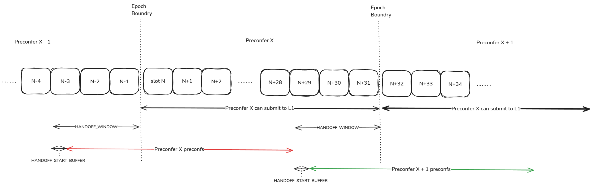
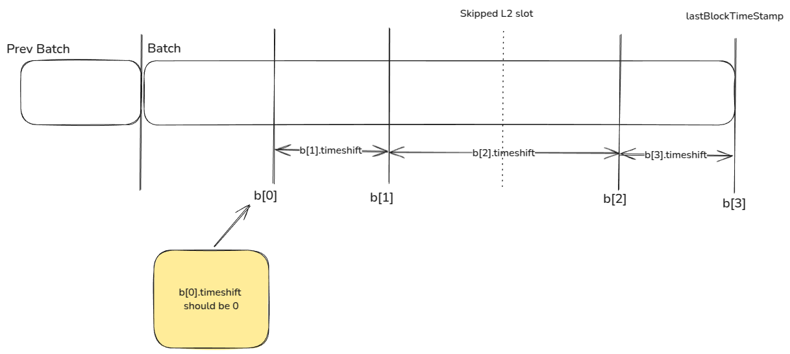

# Taiko Preconf Whitelist Launch Specs

## Parameters

- **`L2_BLOCK_TIME_MS`** (in ms): The expected time between one preconfirmation publication to another.
- **`HANDOVER_WINDOW_SLOTS`** (in slots)**:** The timeframe during which the current preconfer transfers preconf responsibilities to the next preconfer. This window ensures that preconfed blocks are properly included before the transition.
- **`HANDOVER_START_BUFFER_MS`** (in ms)**:** The maximum wait time at the beginning of the `HANDOVER_WINDOW_SLOTS` for the previous preconfer's final preconfed L2 block.
- **`DEFAULT_ANCHOR_ID_LAG`** (in slots): The default number of L1 blocks to lag behind the current L1 when setting the anchor ID.
- **`PRECONF_MIN_TXS`** (in txs): Minimum transaction count below which you don’t have to preconfirm.
- **`PRECONF_MAX_SKIPPED_L2_SLOTS`** (in L2 slots): Maximum number of consecutive L2 blocks you can skip before you must preconfirm regardless of transaction count.

### Current Values

Based on what Gattaca is using, it can change based on experiments.

- **`L2_BLOCK_TIME_MS` : 2000ms**
- **`HANDOVER_WINDOW_SLOTS` : 4**
- **`HANDOVER_START_BUFFER_MS` : 6000ms**
- **`DEFAULT_ANCHOR_ID_LAG` : 4**
- **`PRECONF_MIN_TXS` : 5**
- **`PRECONF_MAX_SKIPPED_L2_SLOTS` : 2**

## Timeline Diagram

The diagram below illustrates the key timings associated with the whitelist launch. Note that `HANDOFF_WINDOW_SLOTS` is set to 3 in the diagram, but this value can be adjusted as needed.

## Components

- **Preconfer Operator Sidecar:** Run by each preconf operator to manage preconfirmation duties. Its tasks include detecting when the operator is assigned as a preconfer for upcoming slots and publishing preconfs via the Taiko Client.
- **Taiko Client:** Run by any entity interested in tracking Taiko’s current head, including preconf operators. Its tasks include publishing preconf L2 blocks (created by the Preconfer Operator Sidecar) to the preconf P2P network and listening to the preconf P2P network to update its view of the head based on the current preconfer.

## Preconfer Operator Sidecar

**TODO: Add description of forced inclusion handling**

As `Preconfer X`, who is assigned the epoch containing slots `N` through `N+31`:

1. During slot `N - HANDOFF_WINDOW_SLOTS - 1`, `Preconfer X` calls `getOperatorForNextEpoch` in `PreconfWhitelist.sol` ([code](https://github.com/taikoxyz/taiko-mono/blob/b22ed04f6f5c91165e169c7acd18188985a908aa/packages/protocol/contracts/layer1/preconf/impl/PreconfWhitelist.sol#L84)) and verifies that the returned operator is itself.
2. At the start of slot `N - HANDOFF_WINDOW_SLOTS`
    1. Poll `/status` from Taiko client until both:
       - `status.endOfSequencingMarkerReceived` is `true` OR `HANDOVER_START_BUFFER_MS` passes since the start of handover.
       - `status.highestUnsafeL2PayloadBlockID` is in sync with Taiko geth chain tip.
    3. After the above checks, `Preconfer X` will start preconfing based on its latest-seen preconfed block from the previous preconfer.
    4. There is a further edge case where the previous preconfer does not propagate the preconfed L2 block on time but still includes them into the L1, reorging the preconfs by `Preconfer X`—more on handling this in the “Edge Case” section.
3. For slots `N - HANDOFF_WINDOW_SLOTS` to `N + 32 - HANDOFF_WINDOW_SLOTS`, for every `L2_BLOCK_TIME_MS` interval (see [Preconfing Timestamps](## Preconfing Timestamps) section for more details on the interval) `Preconfer X` should produce valid L2 blocks, subject to the following conditions:
    - If the transaction count in the mempool is strictly below `PRECONF_MIN_TXS`, the preconfer may skip producing a block for that interval.
    - However, if the preconfer has skipped `PRECONF_MAX_SKIPPED_L2_SLOTS` consecutive L2 blocks before the current interval, they must produce a block regardless of transaction count.
    
    The exact process is up to the implementation, but the process expected by Taiko client is:
    1. Calculate the `baseFee` by following the rules [here](https://github.com/taikoxyz/taiko-mono/blob/main/packages/protocol/contracts/layer2/based/TaikoAnchor.sol#L340).
    2. Fetch L2 transactions from the mempool by calling `taikoAuth_txPoolContent` (or `taikoAuth_txPoolContentWithMinTip`) RPC (JWT required) to taiko-geth ([code](https://github.com/taikoxyz/taiko-mono/blob/e14cad6f0acb4eb8589a5789589907fe3e88699f/packages/taiko-client/driver/preconf_blocks/api.go#L80-L81)).
        - The `baseFee` calculated above is passed here to ensure the fetched transaction has enough base fee to be included.
    3. Fetch the current L2 block height from taiko-geth.
    4. Based on the fetched L2 transactions, construct an L2 block (= list of L2 transactions + some additional metadata) to preconf.
    5. Calculate the anchor transaction and add it to the above L2 block.
        - The anchor ID should be set as `DEFAULT_ANCHOR_ID_LAG` behind the current L1 block number.
    6. Calculate or fetch [other required fields](https://taikoxyz.github.io/taiko-mono/preconf_blocks_api/#/default/post_preconfBlocks) to advance the head, such as:
        1. `baseFeePerGas`: Base fee of the new L2 block.
        2. `extraData` in which should contain the `baseFeeConfig.sharingPctg` calculated like [this](https://github.com/taikoxyz/taiko-mono/blob/main/packages/protocol/contracts/layer1/based/TaikoInbox.sol#L156)
        3. `blocknumber`: L2 block ID of the newly preconfed L2 block.
        4. `parentHash`: Hash of the previous L2 block.
        5. `gasLimit`: Should be always `241,000,000`
4. Send the constructed L2 block, the signature, and other required fields to the `/preconfBlocks` API in the local taiko-client ([swagger](https://taikoxyz.github.io/taiko-mono/preconf_blocks_api/#/default/post_preconfBlocks)) to advance the head and publish the preconfed block to P2P.
5. For any L2 blocks preconfed from slot `N - HANDOFF_WINDOW_SLOTS` to `N`, do not submit to L1 even if they are ready to be submitted (see next item for what it means to be *ready*), and only submit after slot `N`.
    - This can be implemented by introducing a “pending ready L1 submissions” queue which is only dequeued from slot `N` and onwards.
6. From slot `N` to slot `N+31`, `Preconfer X` can submit its preconfed L2 blocks to the L1.
    - For the first submission, the preconf operator must include any preconfed L2 blocks that the previous preconfer failed to include in L1. This can be done by:
        - Before submitting their first batch to L1, preconfers should verify that there are no gaps between the L2 head in the L1 contract (fetched via `taiko_headL1Origin`) and the first block of their batch. If a gap is found, they must first submit any previously preconfed L2 blocks present at the taiko-client's head that were not submitted to L1 on time by the previous preconfer. Note that this only works for the whitelist launch, which can rely on altruism / offchain settlement, and we must reconsider this design for post-whitelist launch.
    - The preconf operator can aggregate and batch L2 blocks as they wish during their epoch to reduce L1 gas cost, i.e., when the L2 blocks are *ready* to be submitted to L1. Each sidecar may implement different strategies. As an example, this can be either when:
        - Reach `N + 32 - HANDOFF_WINDOW_SLOTS`
        - Reach `maxBlocksPerBatch` for your batch.
        - Filled some configured number of blobs (e.g., 3 blobs).
7. For the final L2 block that the operator preconfs, when calling the `/preconfBlocks` RPC, set `BuildPreconfBlockRequestBody.EndOfSequencing` to true. 
8. From slot `N + 32 - HANDOFF_WINDOW_SLOTS` to slot `N + 31`, `Preconfer X` should stop preconfing and focus on L1 submission of its preconfed blocks. The next preconfer `Preconfer X + 1` should start preconfing at this point.

## Preconfing Timestamps

We divide each L1 slot into multiple L2 slots based on the `L2_BLOCK_TIME_MS`. For example, with `L2_BLOCK_TIME_MS = 2000ms` and an L1 slot lasting 12 seconds, we have 6 L2 slots per L1 slot. These L2 slots are timestamped at `0s, 2s, 4s, 6s, 8s, 10s` after the start of the L1 slot.

Each preconfirmation should be published precisely at the start of its corresponding L2 slot, using a timestamp that matches this L2 slot's start time. Preconfirmations for specific L2 slots may be omitted if there are no L2 transactions to include.

Additionally, when submitting preconfirmations to L1, the `timeshift` field must correctly align with the L2 timestamps used in the preconfirmations. The `timeshift` field represents the time difference (in seconds) between an L2 block's timestamp and its parent L2 block's timestamp within the same batch. There is no parent block within the batch for the first block in a batch, so the `timeshift` should be set to 0. For example, if a proposer preconfirms four L2 blocks (`b[0]` to `b[3]`) within their slot, the `timeshift` field should be set as follows:

## Taiko Client

There are two cases in which Taiko client is used:

- **For preconf publication**: Let preconf sidecar push L2 blocks to propagate to P2P.
- **For head syncing:** Let any L2 node operator sync with the latest preconfed head.

### For Preconf Publication

As described in the “Preconfer Operator Sidecar” section, the Taiko client must:

1. [In `taiko-geth`] Provide an endpoint (`taikoAuth_txPoolContent`) for fetching L2 transactions for preconfs.
2. Provide an endpoint (`preconfBlocks`) to update the local head and publish the preconfed L2 block to the P2P network.

Because the Taiko client signs the gossiped (preconfed) L2 block within the `preconfBlocks` API call, it needs access to the preconf operator’s secret key. This key must be passed through the Taiko client’s CLI using the parameter `--p2p.sequencer.key <KEY>` where `<KEY>` is a hex encoded private key.

### For Head Syncing

Any Taiko client that wants to sync with the preconfed head should:

1. Listen for preconfed L2 blocks in the preconf P2P network.
2. Verify the L2 block’s signature based on its slot within the epoch. Considering the `HANDOFF_WINDOW_SLOTS` the signature should be from either:
    - The current epoch's preconf operator is fetched from `getOperatorForCurrentEpoch` in `PreconfWhitelist.sol` (see [code](https://github.com/taikoxyz/taiko-mono/blob/b22ed04f6f5c91165e169c7acd18188985a908aa/packages/protocol/contracts/layer1/preconf/impl/PreconfWhitelist.sol#L68-L69)).
    - The next epoch's preconf operator is fetched from `getOperatorForNextEpoch` in `PreconfWhitelist.sol` (see [code](https://github.com/taikoxyz/taiko-mono/blob/b22ed04f6f5c91165e169c7acd18188985a908aa/packages/protocol/contracts/layer1/preconf/impl/PreconfWhitelist.sol#L84)).
    - If not signed by either, the preconfed blocks should be ignored.

## Reorg Handling

### Taiko Client

Currently, there are two sources for determining the L2 head:

- The **L1 inbox** (referred to as **L1**)
- The **preconfirmation P2P network** (referred to as **P2P**). Alternatively, if the node is the current preconfer, L2 blocks may come from the `/preconfBlocks` RPC, but such blocks are treated the same as blocks from P2P in taiko client.

Rules for selecting the L2 head:

- **No Conflict:** If the L1 and P2P heads do not conflict, select the head with the higher L2 block number (typically the P2P head).
- **Conflict between L1 and P2P:** If there's a conflict between the L1 and P2P heads, prioritize the L1 head and ignore the P2P head. I.e., L2 blocks from L1 can *only* be reorged by an L1 reorg and not be reroged by blocks from P2P.
- **Conflict between P2P:** If two conflicting blocks with the same L2 block number are received from P2P, taiko client will accept the “last received L2 block” if the “last received L2 block” builds upon the L2 blocks in the current branch. Eventually, the L1 inbox will resolve any forks.
    - For example, if the P2P received L2 blocks `A, B, C, B', C'` in this order, the taiko client will `insert A → insert B → insert C → reorg to B’ → insert C’`. However, if it received `A, B, C, C'` where `C'` builds upon `B'`, `C'` will be ignored.

